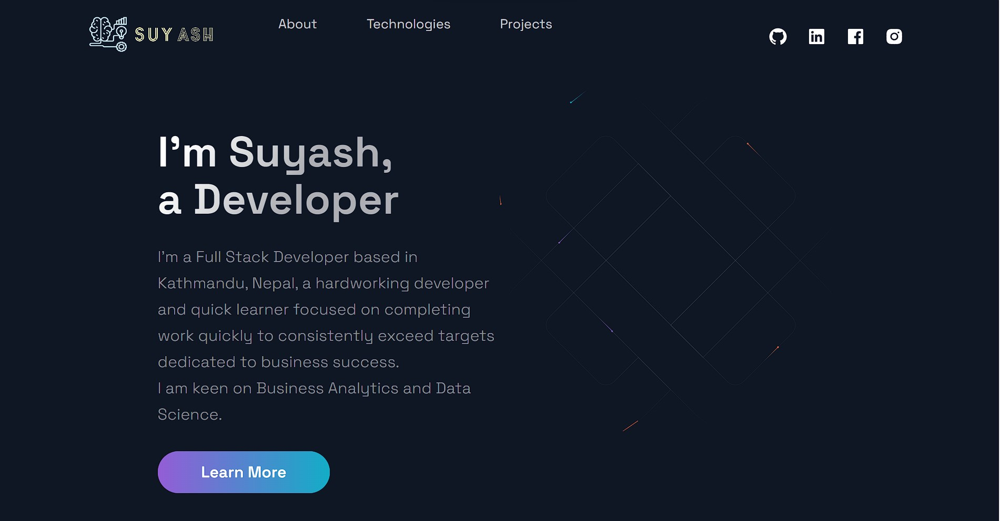

# Portfolio Site

- [Personal Site](https://sthsuyash.netlify.app/) made using nextJs<br/>
  [](https://sthsuyash.netlify.app/)

## Requirements

- nodeJS
- nextJS

## To run locally

- Clone the repo

  ```bash
    git clone https://github.com/sthsuyash/portfolio
  ```

- ```node
  npm install
  ```

- ```node
  npm run build
  ```

- ```node
  npm start
  ```
