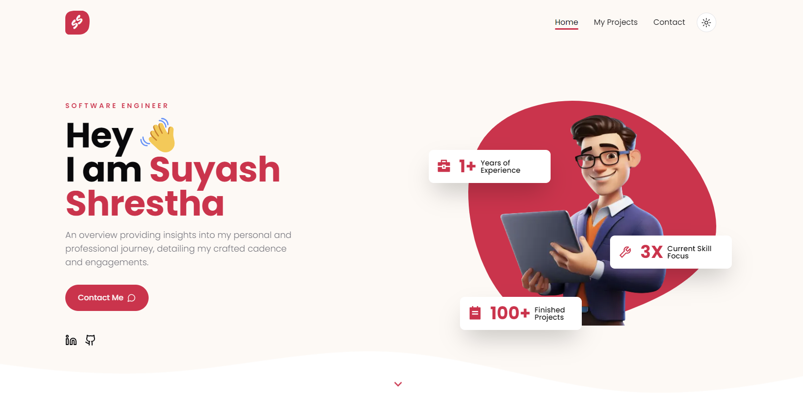

# Portfolio

Welcome to my portfolio repository! This contains the codebase for my web portfolio, where I showcase my skills and projects in the tech field.



## Getting Started

To view my portfolio site locally, follow these steps:

1. Clone the repository:

   ```bash
   git clone https://github.com/sthsuyash/Portfolio.git
   ```

2. Navigate to the project directory:

   ```bash
   cd Portfolio
   ```

3. Install the dependencies:

   ```bash
   pnpm install
   ```

4. Start the development server:

   ```bash
    pnpm run dev
    ```

5. Open <http://localhost:5000> with your browser to see the result.

## Technologies Used

- Next.js

## Contact

Feel free to reach out to me via:

- [LinkedIn](https://www.linkedin.com/in/sthsuyash/)
- [Email](mailto:shrestha.suyash33@gmail.com)

Thank you for checking out my portfolio repository!
